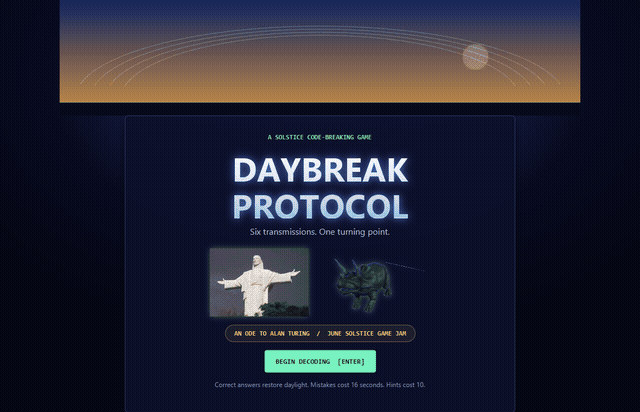

The repository also includes a 27-second MP4 gameplay demo at `docs/media/daybreak-protocol-demo.mp4`.

## What I Built

**Daybreak Protocol** is a short, replayable code-breaking game where daylight is both your timer and your reward.

The Daybreak Engine has caught six archive transmissions during the June solstice. To preserve them, the player repairs a symbolic Bombe by solving puzzles based on Caesar shifts, XOR, lossless compression, parity, contradiction-based elimination, and binary search. Every mistake pushes the sun toward the horizon. Every correct answer restores a little light.

The final result is not simply win or lose. Remaining daylight determines which ending you reach, because a solstice is a turning point.

## Demo

The demo above shows the real JavaFX game: the moving sun, a contradiction, a hint, restored Bombe relays, supplied animated artwork, and the final ending.

## How It Connects To June

The moving solstice sun is the game's main resource and visual anchor. The archive also carries June signals about Pride, freedom, and Alan Turing's legacy. I wanted those themes to feel connected by one idea: important signals survive when people choose to understand and preserve them.

## An Ode To Alan Turing

I pursued the **Best Ode to Alan Turing** category by making algorithms the actual verbs of play.

The player does not merely read a story about code-breaking. They rotate a Caesar shift, reverse XOR, compress a spectrum without losing information, repair parity, eliminate an impossible Enigma-style crib through contradiction, and use binary search at the final turning point.

The symbolic Bombe on the right side illuminates one relay at a time. Short explanations after each puzzle make the game approachable even if the player has never studied cryptography.

## How I Built It

I built the game from scratch in JavaFX. The interface is assembled entirely in Java, with CSS for the visual system and a custom Canvas component for the animated sun path. A lightweight game-session model tracks daylight, scoring, streaks, hints, mistakes, endings, and a persistent local high score.

The project deliberately has no downloaded runtime dependencies. It builds with an installed JavaFX JDK and includes one-click Windows scripts plus a dependency-free logic test.

The game was created with assistance from OpenAI Codex. Supplied character and animation assets are credited in the repository. The procedural sun dial, code, writing, puzzle design, and UI were created for this jam.

## What I Learned

The hardest design problem was making educational puzzles feel like one escalating game instead of six quiz questions. The daylight economy solved that: reasoning, hints, and mistakes all change the same visible system. The sun makes abstract algorithmic choices feel immediate.

I also learned that contradiction is a surprisingly satisfying positive mechanic. A wrong possibility is not useless; eliminating it is progress. That became the emotional center of the game.

## Repository And Play Instructions

> Add the public GitHub repository URL here.

On Windows, double-click `DaybreakProtocol.exe`; it includes its own JavaFX runtime. Controls are `1` to `4` for answers, `H` for a hint, and `Enter` to continue. Mouse controls are also supported.
